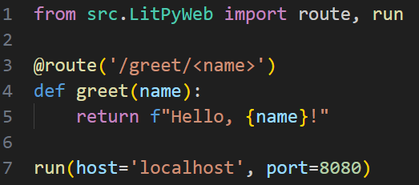
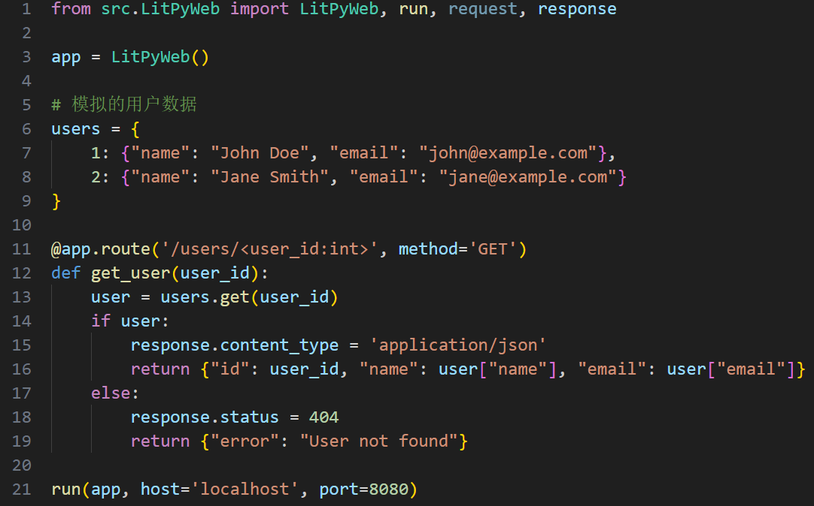
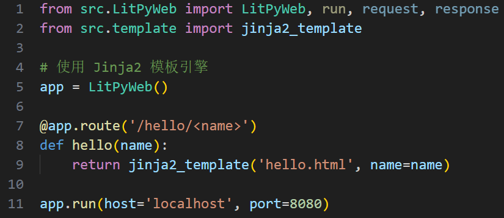
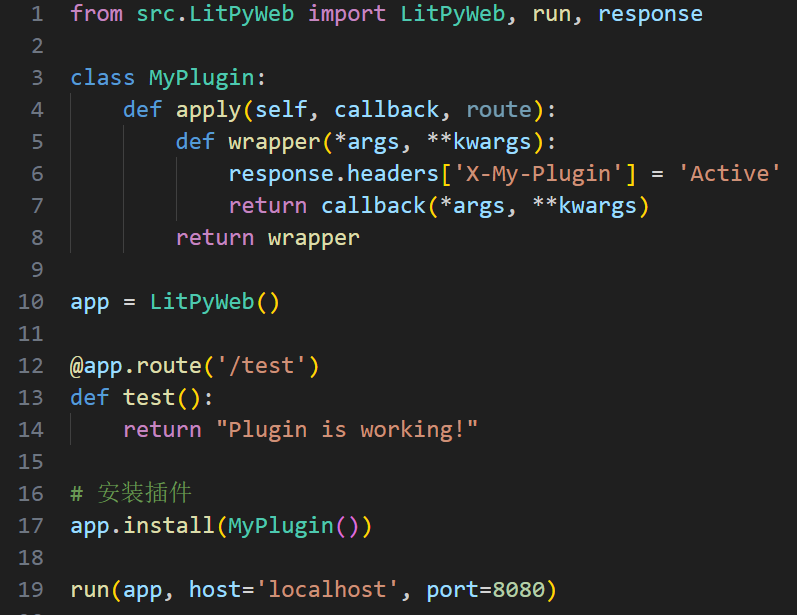

# <h1 align="center">LitPyWeb 轻量级Python Web框架</h1>
<p align="center">
  
  
</p>

<p align="center">
  <em>⚡ 多引擎路由配置Web服务器访问控制 | 支持 mako/WSGI/jinjia2/paste/cherroot</em>
</p>

---

## 🌟 核心特性

### 🚀 单文件轻量部署
- **低依赖部署**：框架本身不涉及任何复杂知识库的调用，便于嵌入系统或快速部署
- **跨平台兼容**：支持多种 WSGI 服务器（如 gunicorn、paste、bjoern等）
- **内置工具集成**：集成模板、路由、请求响应、调试器，无需外部插件

### 🎛 灵活的路由与插件机制
- **路由定义简单**：使用预定义的装饰器即可绑定路径与方法
- **支持 RESTful 风格**：支持路径参数、动态路由、请求方法限制
- **插件扩展方便**：可自定义插件，实现如数据库连接、用户验证等扩展功能

### 📊 适合嵌入与小型应用
- **内嵌式开发友好**：可集成进桌面应用、嵌入式设备、调试工具
- **原型开发利器**：非常适合用来快速验证产品或构建小型 Web 服务
- **教学示范简洁**：广泛用于教学与脚本级 Web 自动化开发场景

### 🧩 数据处理与模板渲染
- **支持多模板引擎**：内置 SimpleTemplate，可以兼容多种引擎模板
- **表单和参数解析**：支持 GET/POST 参数自动提取与转换
- **JSON/文件响应**：内置 JSON 输出、文件下载、静态文件服务功能

---

## 🛠 快速开始

### 环境要求
- Python 3.8+ （推荐3.9/3.10）

### 安装步骤
```bash
克隆仓库
git clone https://github.com/Dr-Setsuna/LitPyWebgit

安装依赖
pip install -r requirements.txt

启动应用
python LitPyWeb.py
```
  
---

## 🖥 界面预览

| 路由配置 | REST设计 |
|----------|----------|
|  |  |

| 引擎模板 | 自定义插件 |
|----------|----------|
|  |  |

---

## 📚 进阶指南

- [跨站请求处理（CORS）与安全防护建议](https://bottlepy.org/docs/dev/recipes.htm#cross-origin-resource-sharing-cors)
- [多应用管理：AppStack 与自定义中间件](https://bottlepy.org/docs/dev/recipes.htmlswitching-between-multiple-applications)
- [WSGI 服务适配与部署优化技巧（Gunicorn/uWSGI）](https://bottlepy.org/docs/dev/recipes.htmusing-gunicorn)

---
为了部落！
